# Samuel Torres (SamukaDEV)
Web Developer | FrontEnd | BackEnd

## Overview

- GitHub: [SamukaDEV](https://github.com/SamukaDEV)
- Primary Expertise: Web Development
- Languages: HTML5, JavaScript, CSS, SQL
- Additional Languages (Hobbies): C#, VB.Net, C++, Rust, TypeScript, Java, Python
- Hobbies: Game Development, 3D Modeling

## About Me

Hello! I'm SamukaDEV, a passionate web developer with over 5 years of experience in the field. I am proficient in HTML5, JavaScript, CSS, and have hands-on experience with both frontend and backend development. I also have extensive knowledge of SQL, MySQL, and SQL Server for database management.

In addition to my primary expertise, I have explored various programming languages as hobbies. I have worked with C#, VB.Net, C++, Rust, TypeScript, and Java on personal projects, expanding my skill set and knowledge base.

Aside from coding, I have a keen interest in game development. I enjoy creating personal projects, including game development and 3D modeling. These hobbies allow me to explore my creativity and enhance my problem-solving skills.

I'm excited to collaborate with other developers and contribute to open source projects. Feel free to explore my GitHub repositories to see my past work and contributions.

## Skills

- Web Development: HTML5, JavaScript, CSS, Frontend, Backend
- Databases: SQL, MySQL, SQL Server
- Additional Languages: C#, VB.Net, C++, Rust, TypeScript, Java
- Databases(Hobbies): MongoDB, Postgre
- Game Development
- 3D Modeling

<!-- ## Projects
Here are some noteworthy projects I have worked on:
- [Project 1](https://github.com/SamukaDEV/project1): A web application that showcases my frontend skills using HTML, CSS, and JavaScript.
- [Project 2](https://github.com/SamukaDEV/project2): A full-stack web application developed with HTML, CSS, JavaScript, and a backend framework like Express.js.
- [Project 3](https://github.com/SamukaDEV/project3): A game developed using one of my hobby languages, Rust, showcasing my skills in game development.

Feel free to explore these repositories for a closer look at my coding style and project contributions. -->

## Contact

- GitHub: [SamukaDEV](https://github.com/SamukaDEV)
- Email: [absfregs@gmail.com](mailto:absfregs@gmail.com)
- Website: [Samuel Torres](https://absfregs.com/profile)

Please don't hesitate to reach out to me via GitHub or Email. I'm open to collaboration and always excited to discuss new opportunities.

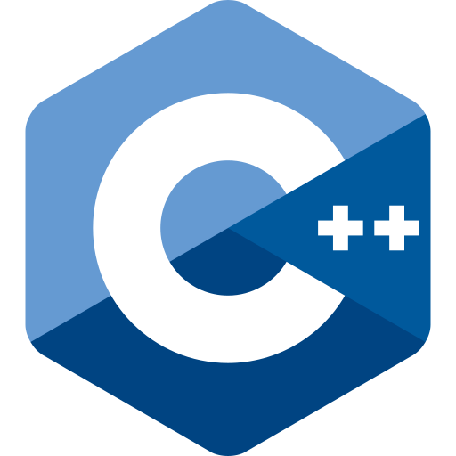
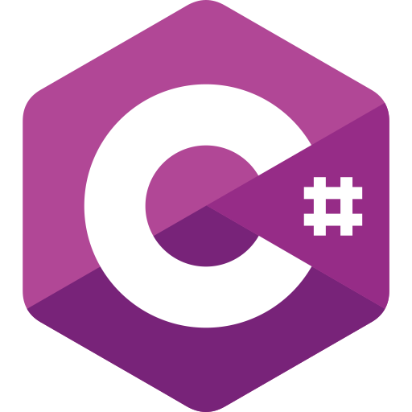
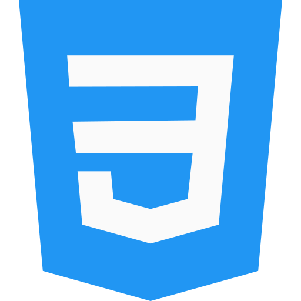
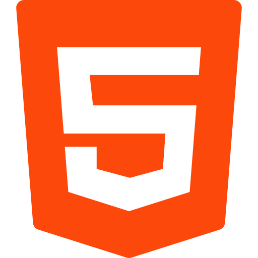
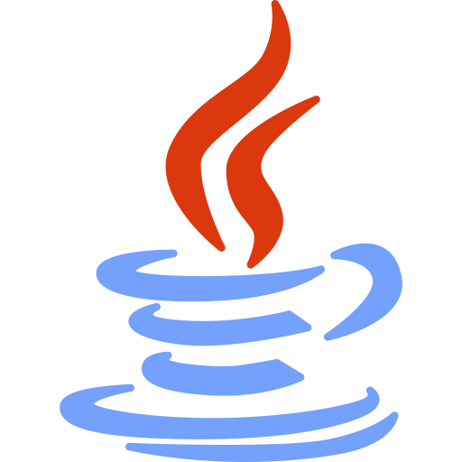
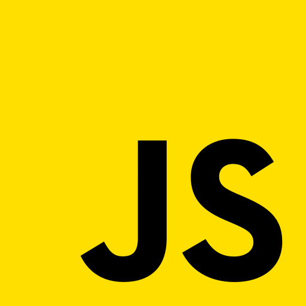
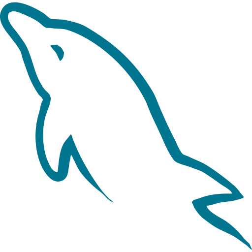
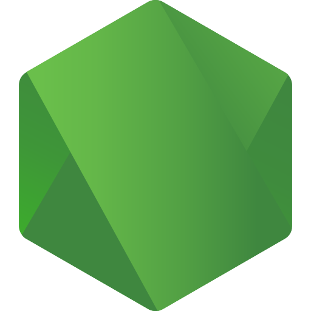
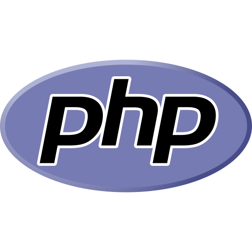

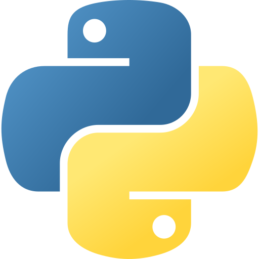

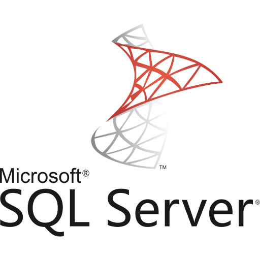
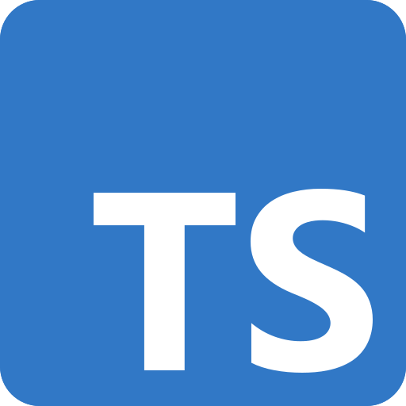
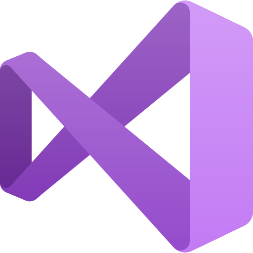

